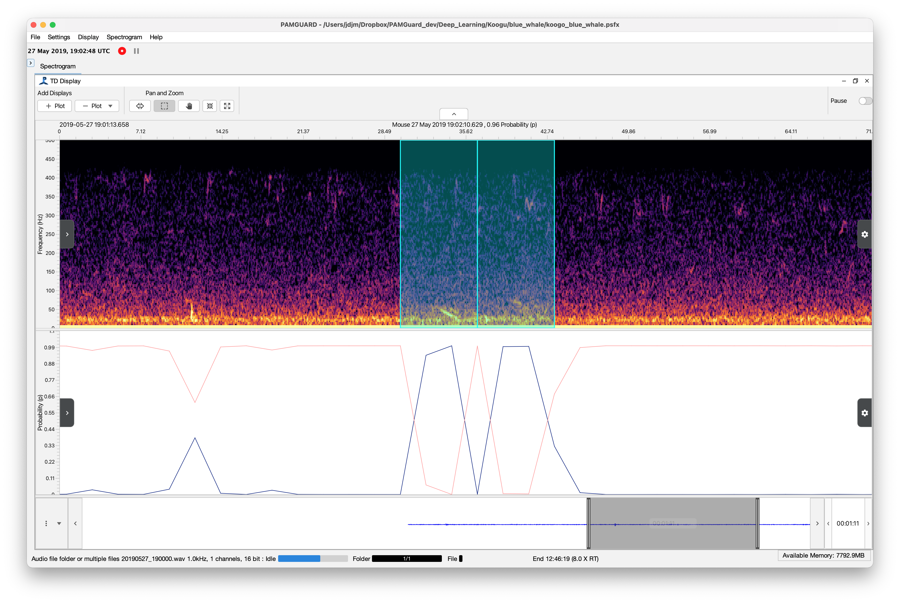

# Blue whale D-call detector

## Introduction

This is a deep learning model for detecting **blue whale D-calls** developed by Miller et al. (2022). The model uses spectrogram representations of underwater acoustic recordings and a custom quasi-DenseNet ([Madhusudhana et al., 2020](https://doi.org/10.1121/1.5146737)) to automatically identify D-calls in passive acoustic monitoring datasets.

Blue whale D-calls are low-frequency social vocalisations that are highly variable across individuals, seasons, and locations. This variability makes automated detection challenging using traditional signal processing approaches. The deep learning approach used by Miller et al. was trained on a large annotated dataset of Antarctic blue whale calls and learned to recognise the spectrogram patterns associated with these vocalisations.

The detector was trained using data collected from Antarctic monitoring sites between 2005 and 2017. The data were manually annotated by multiple analysts before being used to train and validate the model.

In evaluation tests, the automated detector **outperformed experienced human analysts**, detecting a higher proportion of calls and performing particularly well for low signal-to-noise ratio events. In one comparison, the algorithm detected about **90% of calls compared with just over 70% detected by human observers**, while also processing the data orders of magnitude faster.

Note that this model is also available as an example model within PAMGuard.

## Species

Blue whale (*Balaenoptera musculus*)

## Geographic location of training data

Antarctic monitoring sites (Southern Ocean)

## Reference

Miller, B. S., Madhusudhana, S., Aulich, M. G., Kelly, N., (2022). Deep learning algorithm outperforms experienced human observer at detection of blue whale D-calls: a double-observer analysis.\
Remote Sensing in Ecology and Conservation 9(1), 104–116.\
https://doi.org/10.1002/rse2.297

## Model

The model is provided as a trained deep learning detector compatible with the PAMGuard Deep Learning module. The detector analyses spectrogram segments derived from acoustic recordings and outputs a probability that a blue whale D-call is present within each segment.
