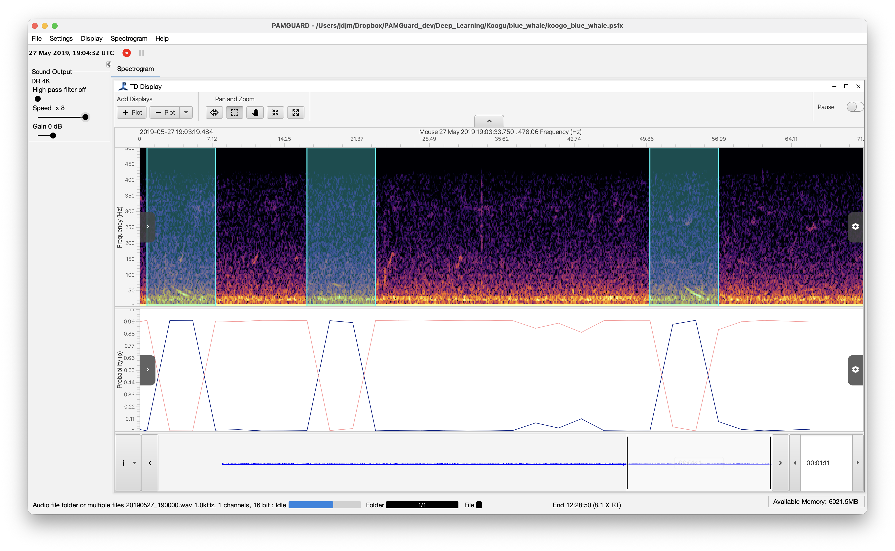

# Blue whale D-call detector

## Introduction

This is a deep learning model for detecting **blue whale D-calls** developed by Miller et al. (2022). The model uses spectrogram representations of underwater acoustic recordings and a custom quasi-DenseNet ([Madhusudhana et al., 2020](https://doi.org/10.1121/1.5146737)) to automatically identify D-calls in passive acoustic monitoring datasets.

Blue whale D-calls are low-frequency social vocalisations that are highly variable across individuals, seasons, and locations. This variability makes automated detection challenging using traditional signal processing approaches. The deep learning approach used by Miller et al. was trained on a large annotated dataset of Antarctic blue whale calls and learned to recognise the spectrogram patterns associated with these vocalisations.

The detector was trained using data collected from Antarctic monitoring sites between 2005 and 2017. The data were manually annotated by multiple analysts before being used to train and validate the model.

In evaluation tests, the automated detector outperformed experienced human analysts, detecting a higher proportion of calls and performing particularly well for low signal-to-noise ratio events. In one comparison, the algorithm detected about 90% of calls compared with just over 70% detected by human observers, while also processing the data orders of magnitude faster.

## Species

Blue whale (*Balaenoptera musculus*)

## Geographic location of training data

Antarctic monitoring sites (Southern Ocean)

## Performance

The detector was tested on 187 hours of recordings spread throughout the Casey 2019 dataset, which is independent of the training data. An experienced human analyst annotated the same recordings. Wherever the detector (at a score threshold of 0.99) and the analyst disagreed, an independent judge decided whether the detection was a D-call, and a double-observer (Huggins mark-recapture) model was then used to estimate the total number of calls present (1773) and the probability of detection for each.

| Observer | True positives | False positives | Proportion of D-calls detected |
|------------------|------------------|------------------|------------------|
| Deep learning detector | 1597 | 207 | 90.1% |
| Experienced human analyst | 1319 | 253 | 74.4% |

The advantage of the detector was at low and medium signal-to-noise ratios (SNR), where its probability of detection stayed roughly constant whilst that of the analyst fell.

| SNR    | Deep learning detector | Human analyst |
|--------|------------------------|---------------|
| Low    | 0.905                  | 0.699         |
| Medium | 0.910                  | 0.697         |
| High   | 0.888                  | 0.826         |

The detector processed the 187 hours of test data in around 30 seconds on a laptop with a mid-range GPU. Before adjudication, when the analyst's annotations were treated as ground truth, the detector appeared to have much lower precision, so the measured performance of a detector can depend heavily on the quality of the annotations it is tested against. As with any deep learning classifier, performance should be checked before it is applied to a new region or recording system.

## Reference

Miller, B. S., Madhusudhana, S., Aulich, M. G., Kelly, N., (2022). Deep learning algorithm outperforms experienced human observer at detection of blue whale D-calls: a double-observer analysis.\
Remote Sensing in Ecology and Conservation 9(1), 104–116.\
<https://doi.org/10.1002/rse2.297>

## Model

The model is provided as a trained deep learning detector compatible with the PAMGuard Deep Learning module. The detector analyses spectrogram segments derived from acoustic recordings and outputs a probability that a blue whale D-call is present within each segment.
