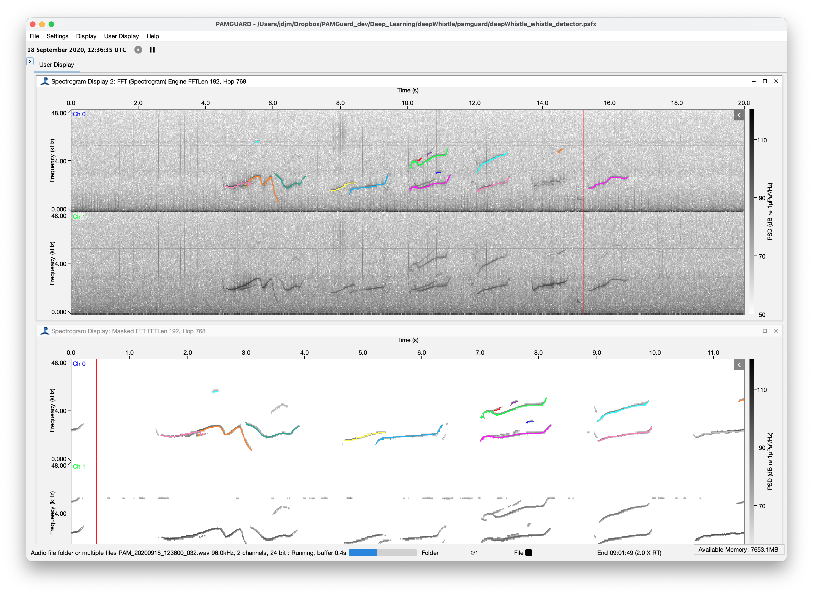

## Introduction

The **Deep Whistle** module uses deep learning to enhance tonal sounds, such as dolphin whistles, in a spectrogram. It takes the output of an FFT (spectrogram) module and applies a learned **mask**. The mask keeps the time-frequency bins that belong to whistle contours and suppresses everything else, such as background noise, clicks and broadband transients. The result is a new *masked* FFT data block. This can be shown as a much cleaner spectrogram or passed to a downstream detector, such as the Whistle and Moan Detector. By increasing the signal-to-noise ratio, the module can improve detection rates and reduce false positives.

Unlike the other models on this page, the Deep Whistle models are **built into PAMGuard** and do not need to be downloaded separately. Two models are currently available and can be selected from the module settings:

1.  **Deep Whistle**: a convolutional neural network from the *silbido* DeepWhistle project, trained on synthetic whistle data ([Li et al., 2020](https://doi.org/10.1109/IJCNN48605.2020.9206992)).

2.  **SAM-Whistle**: an adaptation of Meta's *Segment Anything Model* (SAM) foundation model, trained on the DCLDE 2011 dataset ([Zhang et al., 2025](https://doi.org/10.1038/s41598-025-21642-x)).

For each time-frequency bin, the model returns a confidence that the bin is part of a whistle. Bins below a user-defined confidence threshold are removed. The models focus on the 5–50 kHz band.

## Species

Delphinid whistles (general, not species-specific)

## Geographic location of training data

Deep Whistle: synthetic whistle data. SAM-Whistle: DCLDE 2011 dataset.

## Reference

Li, P. et al., 2020. Learning deep models from synthetic data for extracting dolphin whistle contours. 2020 International Joint Conference on Neural Networks (IJCNN), 1–10. https://doi.org/10.1109/IJCNN48605.2020.9206992

Zhang, X. et al., 2025. Automating time × frequency annotations of delphinid whistles by adapting a foundational transformer neural network. Scientific Reports 15, 37809. https://doi.org/10.1038/s41598-025-21642-x

## Model

Both models are built into PAMGuard. To use them, add the module from *File -\> Add Modules -\> Detectors -\> Deep Whistle*. The module needs an FFT Engine as its input. A typical processing chain is:

`Sound Acquisition → FFT Engine → Deep Whistle → Whistle and Moan Detector`

Choose a model from the **FFT Mask** drop-down in the module settings. The model is downloaded automatically the first time it is selected and is then cached locally. Each model was trained at a particular FFT length and hop. If the FFT source does not match, the settings pane shows a warning and a **Set FFT parameters** button that sets it up for you. If you have retrained either model on your own data, use the import button next to the model name to load your custom model.

The SAM-Whistle model is large and runs best on a GPU. On Apple Silicon Macs it runs on the integrated GPU automatically.
