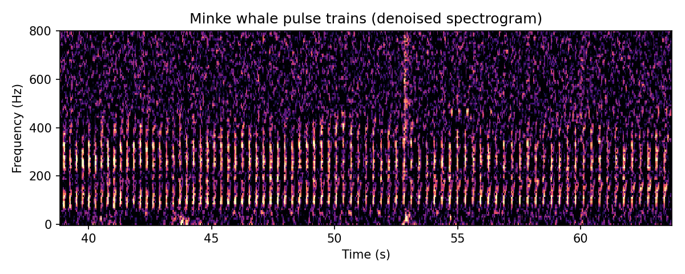

## Introduction

This is a deep learning detector for **North Atlantic minke whale pulse trains** developed by Xavier Mouy and colleagues at NOAA's Northeast Fisheries Science Center, the Scottish Association for Marine Science, the University of Aberdeen and Woods Hole Oceanographic Institution. The detector is a ResNet classifier trained using the [Ketos](https://meridian.cs.dal.ca/2015/04/12/ketos/) deep learning framework.

Minke whale pulse trains are low frequency (below \~800 Hz) sequences of pulses that can last for a minute or more. The model analyses 5 second spectrogram segments and outputs a probability that a minke whale pulse train is present.

## Species

1.  North Atlantic minke whale (*Balaenoptera acutorostrata acutorostrata*)

## Model details

The model expects audio at a sample rate of 2 kHz (PAMGuard will decimate higher sample rate data automatically). Before classification, audio is converted to a dB magnitude spectrogram (0.128 s Hann window, 0.04 s step, 0-800 Hz). The spectrogram is then denoised using a median equalizer which subtracts a 60 second running median from each frequency bin and sets negative values to zero.

Note that in the original Python detector the median equalizer is applied to the spectrogram of the whole recording. In PAMGuard, the deep learning module processes one segment at a time and so the median equalizer is applied to each 5 second segment instead. PAMGuard's scores match the Python model when the same per-segment denoising is used, but, because each segment has less context to estimate the background noise, the scores differ from the original Python detector for some segments. In our tests on an example recording, PAMGuard and the original detector agreed on whether a segment contained a minke whale (score threshold 0.5) for around 83% of segments.

The original detector processes data with a 0.05 s step between segments. In PAMGuard, the hop size of the segmenter can be reduced to increase temporal resolution at the cost of processing time.

## Reference

Mouy X, Awbery T, Davis G, Fernandez-Betelu O, Iorio-Merlo V, Transue L, Van Parijs S, Risch D (2025) North Atlantic minke whale pulse-train detector (version 20240829). Zenodo. <https://doi.org/10.5281/zenodo.15151160>

The detector source code and Python scripts are available on [GitHub](https://github.com/xaviermouy/minke-whale-detector).

## Model

The original Ketos model (model_NAMW_20240523.kt) is archived on Zenodo The PAMGuard compatible version of the model (model_NAMW_20240523.ktpb), which includes the PAMGuard metadata and denoising transforms, can be downloaded [here](./minke_whale_mouy/model_NAMW_20240523.ktpb).

The model is licensed under the GNU General Public License v3.0.
