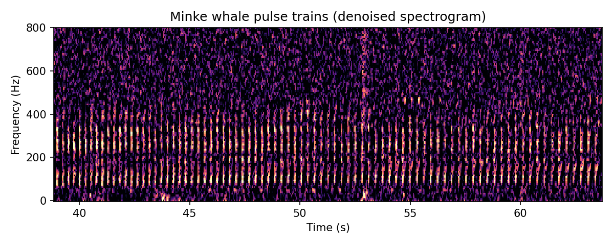

## Introduction

This is a deep learning detector for **North Atlantic minke whale pulse trains** developed by Xavier Mouy and colleagues at NOAA's Northeast Fisheries Science Center, the Scottish Association for Marine Science, the University of Aberdeen and Woods Hole Oceanographic Institution. The detector is a ResNet classifier trained using the [Ketos](https://meridian.cs.dal.ca/2015/04/12/ketos/) deep learning framework.

Minke whale pulse trains are low frequency (below \~800 Hz) sequences of pulses that can last for a minute or more. The model analyses 5 second spectrogram segments and outputs a probability that a minke whale pulse train is present.

## Species

1.  North Atlantic minke whale (*Balaenoptera acutorostrata acutorostrata*)

## Model details {#model-details}

The model expects audio at a sample rate of 2 kHz (PAMGuard will decimate higher sample rate data automatically). Before classification, audio is converted to a dB magnitude spectrogram (0.128 s Hann window, 0.04 s step, 0-800 Hz). The spectrogram is then denoised using a median equalizer which subtracts a 60 second running median from each frequency bin and sets negative values to zero.

Note that in the original Python detector the median equalizer is computed over the spectrogram of the whole recording, so each 5 second chunk is denoised using around 30 seconds of data either side of it. PAMGuard's deep learning module processes one segment at a time, so two versions of the model are provided.

| Model | Segment length | Agreement with the python detector |
|----|----|----|
| `model_NAMW_20240523_60s.ktpb` (recommended) | 60 s | 100% of segments agree at a 0.5 score threshold |
| `model_NAMW_20240523.ktpb` | 5.128 s | 83% of segments agree at a 0.5 score threshold |

The **60 second version** computes the spectrogram and the 60 second median equalizer over a 60 second segment and then trims the centre 5 seconds of the spectrogram for the classifier. Each classified chunk therefore has the same amount of surrounding data to estimate the background noise as in the original detector, and the scores match the python detector almost exactly. When using this model, **set the segmenter hop (segment step) to around 5 s**, otherwise only the centre 5 seconds of every 60 seconds of data is classified. The cost is that the spectrogram is recomputed for a 60 second window at every hop.

The **5 second version** applies the median equalizer to each 5 second segment on its own. It is faster, but with less data to estimate the background noise the scores differ from the original detector for some segments.

The original detector processes data with a 0.05 s step between segments. In PAMGuard, the hop size of the segmenter can be reduced to increase temporal resolution at the cost of processing time.

## Performance

Performance metrics for the detector (e.g. precision and recall) have not yet been published. The authors describe the current version as not yet a final release.

The PAMGuard versions of the model have been compared to the original Python detector (see [Model details](#model-details)): at a 0.5 score threshold the 60 second version agrees on 100% of segments and the 5 second version on 83% of segments. This shows how closely PAMGuard reproduces the original detector, not how accurate the detector is. As with any deep learning classifier, performance should be checked before it is applied to a new region or recording system.

## Reference

Mouy X, Awbery T, Davis G, Fernandez-Betelu O, Iorio-Merlo V, Transue L, Van Parijs S, Risch D (2025) North Atlantic minke whale pulse-train detector (version 20240829). Zenodo. <https://doi.org/10.5281/zenodo.15151160>

The detector source code and Python scripts are available on [GitHub](https://github.com/xaviermouy/minke-whale-detector).

## Model

The original Ketos model (model_NAMW_20240523.kt) is archived on Zenodo The PAMGuard compatible version of the model (model_NAMW_20240523.ktpb), which includes the PAMGuard metadata and denoising transforms, can be downloaded [here](./minke_whale_mouy/model_NAMW_20240523.ktpb).

The model is licensed under the GNU General Public License v3.0.
