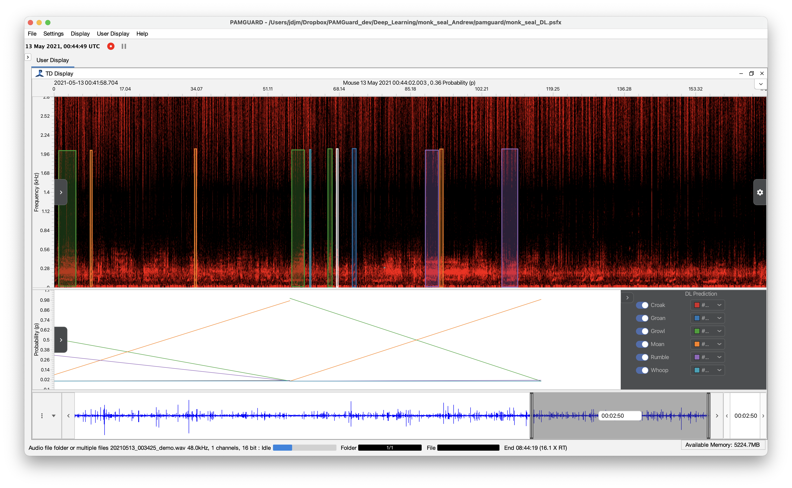

## Introduction

This is a deep learning detector and classifier for **Hawaiian monk seal underwater vocalisations** developed by Jeppe Have Rasmussen, Jillian Sills and colleagues at the [University of California Santa Cruz](https://pinnipedlab.ucsc.edu), the University of Copenhagen and the [Marine Mammal Research Program](https://www.mmrphawaii.org) at the University of Hawaiʻi at Mānoa. The Hawaiian monk seal is an endangered phocid endemic to the Hawaiian Archipelago. It was long thought to be silent underwater, until mature males were found to produce at least six distinct low frequency calls year round, typically in bouts of two or more.

The model is a YOLO object detection network which was pre-trained on images and then fine-tuned on spectrograms of monk seal calls using transfer learning. Unlike most of the other models on this page, which output a single score for each segment of audio, an object detection model finds each call within the spectrogram, so it both **detects** calls in time and **classifies** them to call type.

## Species

1.  Hawaiian monk seal (*Neomonachus schauinslandi*)

The model classifies detections into six call types:

1.  Croak
2.  Groan
3.  Growl
4.  Moan
5.  Rumble
6.  Whoop

## Geographic location of training data

The model was first trained on 4,989 manually labelled calls, and their corresponding spectrogram images, from long-term recordings of a Hawaiian monk seal living in the laboratory.

To move from the laboratory to the field, the model was then re-trained by combining the verified laboratory calls with soundscape recordings from Hawaiʻi at a range of signal-to-noise ratios. This exposes the model to the background noise found in the wild whilst keeping the reliable labels from the laboratory data.

## Model details

<!-- TODO: add the model input details (sample rate, FFT length, hop, frequency range and segment length) once the PAMGuard model is finalised -->

The model is a YOLO network which takes a spectrogram image as input and outputs a set of bounding boxes, each with a call type and a confidence score. The calls are low frequency, with most energy below 1 kHz.

## Performance

| Dataset | Result |
|-------------------------------|-----------------------------------------|
| Laboratory | 87% weighted precision. The model recovered 48,324 calls from 16,262 hours of recordings. |
| Field (re-trained model) | 2,049 calls recovered from 12 hours of recordings from critical habitats with varying background noise levels. |

In both cases, the detections reproduced known patterns in monk seal vocal behaviour: the temporal trends and call sequencing seen in the laboratory, and the patterns of acoustic presence previously documented in the field. As with any deep learning classifier, performance should be checked before it is applied to a new region or recording system.

## Reference

Rasmussen JH, Sills JM, Parnell K, Reichmuth C (2026) Description, detection, and classification of Hawaiian monk seal vocalizations through deep-learning methods: biological and conservation applications. Marine Mammal Science 42(4): e70260. <https://doi.org/10.1111/mms.70260>

The original MATLAB detector, which includes a standalone Windows application, is archived on Zenodo  and is licensed under Creative Commons Attribution 4.0 International.

## Model

<!-- TODO: add the model file to ./monk_seal_Rasmussen/ and update the link below -->

The PAMGuard compatible version of the model can be downloaded here.

To use the model, add the deep learning module (*File -\> Add Modules -\> Classifiers -\> Raw Deep Learning Classifier*) to PAMGuard and load the model in the module settings. The model contains the metadata PAMGuard needs to set up the correct transforms automatically.

