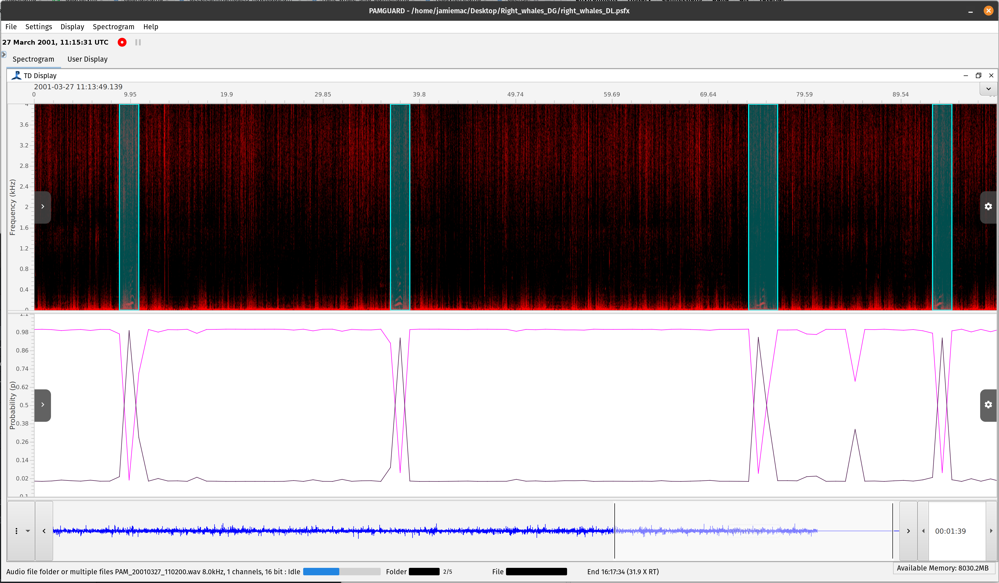

## Introduction

This is a spectrogram based model for detecting right whale up-sweeps developed by Shiu and Palmer et al. (2020). The model was tested on a standardised dataset from the DCLDE conference in 2013 (Detection, Classification, Localisation, and Density Estimation)to quantify the performance compared to other leading automated analysis approaches. Shiu/Palmer et al.’s 2020 deep learning approach outperformed all those efforts by a very wide margin (see Figure 1 in their paper) and was an early demonstration of the potential of deep learning approached in marine bioacoustics.

Note that this model is also available as an example model within PAMGuard.

## Species

1.  North Atlantic right whale (Eubalaena glacialis)

## Geographic location of training data

Cape Cod Bay

## Performance

The model was trained and tested following the DCLDE 2013 workshop protocol: four days of continuous recordings for training and the final three days (72 hours) for testing.

| Test | Result |
|----|----|
| DCLDE 2013 test data | Average precision (area under the precision-recall curve) of 0.903. Roughly double the precision of the best DCLDE 2013 workshop detectors, none of which had a recall above 0.83, and an order of magnitude fewer false positives per hour. |
| Generalisation (33 days of recordings from six regions between Maryland and Georgia, 2012 to 2015, containing 601 upcalls) | Fewer than 0.3 false positives per hour at a recall of 0.70. |

The generalisation test shows that a model trained on a single week of recordings from one location can perform well in other regions and years. As with any deep learning classifier, performance should be checked before it is applied to a new region or recording system.

## Reference

Shiu, Y., Palmer, K.J., Roch, M.A., Fleishman, E., Liu, X., Nosal, E.-M., Helble, T., Cholewiak, D., Gillespie, D., Klinck, H., 2020. Deep neural networks for automated detection of marine mammal species. Scientific Reports 10, 607. <https://doi.org/10.1038/s41598-020-57549-y>

## Model

The model can be found as part of the tutorial data set along with example wav files 

An example settings file can be found [here](./right_whale_shiu_palmer/right_whales_DL.psfx).
