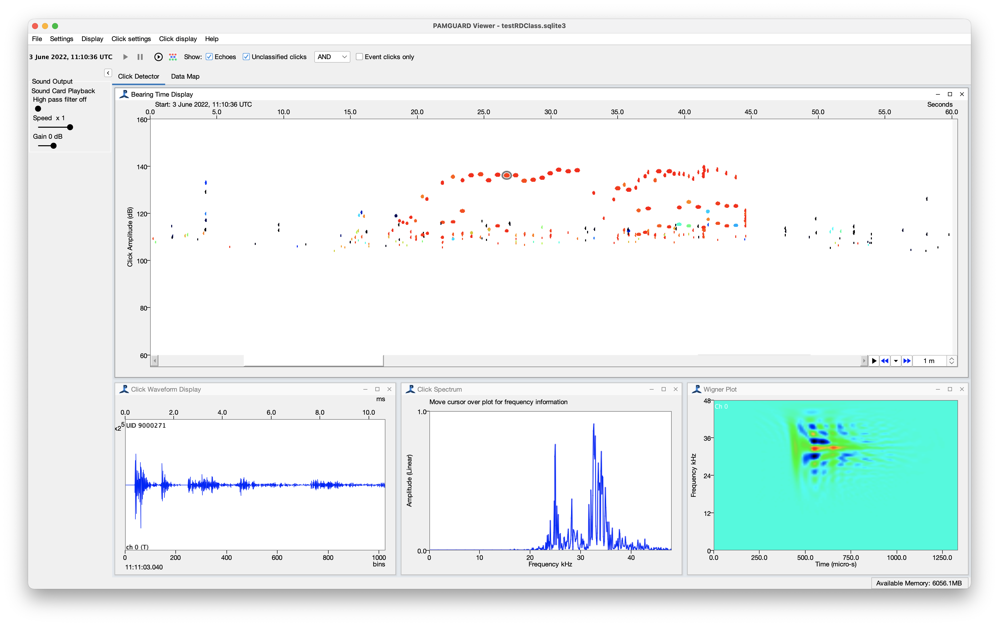

## Introduction

This is a deep learning classifier for **Risso's dolphin echolocation clicks** developed by Thomas Webber and colleagues at the [Scottish Association for Marine Science](https://www.sams.ac.uk), the [Sea Mammal Research Unit](https://www.smru.st-andrews.ac.uk) and collaborating organisations. Risso's dolphins whistle less often than most other delphinids, so monitoring based on whistles alone can underestimate their presence. They do, however, echolocate regularly, and this classifier was developed to identify periods of Risso's dolphin presence in large passive acoustic datasets from Scotland and the wider Northeast Atlantic using clicks alone.

The classifier is a binary Long Short-Term Memory (LSTM) neural network. Unlike most of the other models on this page, it does not analyse segments of continuous raw audio or spectrograms. Instead it works on top of **PAMGuard's click detector**: the waveform of each detected click is passed to the model, which outputs a score between 0 and 1 that the click was produced by a Risso's dolphin.

## Species

1.  Risso's dolphin (*Grampus griseus*)

The classifier is binary: a click is either Risso's dolphin or *other*. The *other* class was trained on clicks from Atlantic white-sided, common bottlenose, common, striped and white-beaked dolphins, long-finned pilot whales and killer whales, as well as noise sources such as vessel cavitation and echo sounders.

## Geographic location of training data

The classifier was trained and validated on over 800,000 manually labelled clicks from 872 visually verified single species encounters. These were recorded on towed hydrophone arrays during surveys spanning 18 years by the [Hebridean Whale and Dolphin Trust](https://hwdt.org) (west coast of Scotland), SCANS-III (Scottish shelf), [IFAW](https://www.ifaw.org/uk) / [Marine Conservation Research](https://www.marineconservationresearch.co.uk) (Northeast Atlantic and Mediterranean) and [Greenpeace Research Laboratories](https://www.greenpeace.to) (Northeast Atlantic and Mediterranean).

It was then tested on an independent 31 hours of visually verified recordings from static and drifting autonomous recorders in Scottish (Latheron, Moray Firth) and English (Northumberland) waters. None of these recorders were used in training.

## Model details

The model expects click waveforms at a sample rate of 96 kHz. Each waveform is trimmed or zero padded to 64 samples centred on the peak amplitude of the click and then z-score normalised (a mean of 0 and standard deviation of 1). The network has three LSTM layers, each followed by 30% dropout, and two dense layers, the last of which has a sigmoid activation to give the classification score. It was built in Keras (2.11) and TensorFlow (2.10).

Training data were recorded at 192 to 500 kHz and re-sampled to 96 kHz. Different re-sampling algorithms round the number of output samples differently, which subtly changes the shape of the waveform, so the training data also included copies of each click with a single zero sample added before re-sampling. This makes the classifier more robust to how, and in which order, data are decimated.

The authors ran the click detector with a 10 kHz high pass pre-filter and trigger filter, and a trigger threshold of 14 dB for towed array data and 10 dB for static recorders.

## Performance

Clicks with a score of 0.4 or above are classified as Risso's dolphin. Individual clicks are often off-axis and distorted, so the classifier is best used by averaging scores over many clicks rather than relying on any single click.

| Level | Dataset | Precision | Recall | F1 |
|---------------|---------------|---------------|---------------|---------------|
| Individual click | Validation (towed array) | 0.90 | 0.87 | 0.91 |
| Event (click train) | Validation (towed array) | 0.98 | 0.98 | 0.98 |
| 5 minute bin | Independent test (static and drifting recorders) | 0.96 | 0.98 | 0.98 |

For the independent test data, the mean score of all clicks in each 5 minute bin was calculated and the bin was classified as Risso's dolphin if the mean was 0.4 or above.

The species most often misclassified as Risso's dolphin during training was the white-beaked dolphin, whose clicks show similar spectral banding. However, none of the white-beaked dolphin recordings in the independent test data were misclassified once scores were averaged over 5 minute bins. As with any deep learning classifier, performance should be checked before it is applied to a new region or recording system.

## Reference

Webber T, Risch D, Hastie G, Sinclair R, Beck S, Berggren P, Boisseau O, Dyke K, Hartny-Mills L, Lacey C, Quer S, Sharpe M, Walters A, Young KF, van Geel N (2026) Monitoring Risso's dolphins in the Northeast Atlantic: a deep learning approach to classify echolocation click detections. Marine Mammal Science 42(2): e70180. <https://doi.org/10.1111/mms.70180>

The Python code, and instructions for using and retraining the classifier, are available on [GitHub](https://github.com/tomwebber96/EcholocationClassification).

## Model

<!-- TODO: add the model file to ./rissos_dolphin_webber/ and update the link below -->

The PAMGuard compatible version of the model can be downloaded here.

To use the model, add a click detector and the deep learning module (*File -\> Add Modules -\> Classifiers -\> Raw Deep Learning Classifier*) to PAMGuard. In the deep learning module settings select the click detector as the data source and then load the model. The model contains the metadata PAMGuard needs to set up the correct transforms (decimation to 96 kHz, trimming around the click peak and normalisation) automatically. The model runs on both CPUs and CUDA enabled GPUs.

## Example

<!-- TODO: add the example viewer dataset (database and binary files) and update the link below -->

The example is a PAMGuard **viewer** dataset containing click detections from an encounter with Risso's dolphins. Because the classifier only needs the click waveforms stored in the binary files, the original sound files are not required and the clicks can be reprocessed in viewer mode.

1.  Open PAMGuard in viewer mode and select the example database. If prompted, set the binary storage location to the example binary folder.

2.  Open the deep learning module settings (*Settings -\> Raw Deep Learning Classifier*), check that the click detector is selected as the data source and select the model file.

3.  Select *Settings -\> Raw Deep Learning Classifier -\> Reclassify detections...*, choose whether to process the loaded data or all data, and press *Start*.

Each click then has a prediction which can be viewed by hovering over or selecting the click, and used to colour clicks in the displays.
