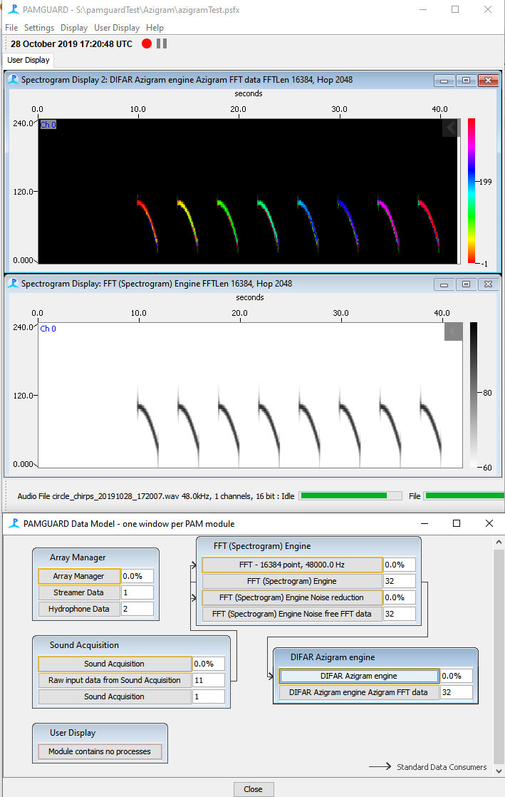
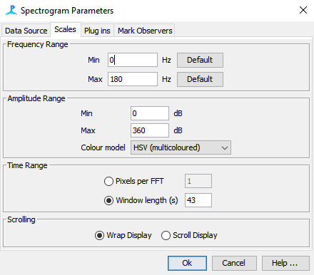

# Azigram plugin

## Introduction

The Azigram shows directional information from a DIFAR sonobuoy. It looks like a spectrogram, but colour shows the bearing of arrival in each time-frequency cell, not its power. Weak cells fade to black, so only real signals show clear bearings.

This makes bearings easy to read at a glance. Calls from different directions show in different colours, even when they overlap in time or frequency.

The plugin implements the Azigram algorithm, and the frequency domain demultiplexing of DIFAR signals, described by Thode et al. (2019). It was part of PAMGuard core until version 2.03, and is now a standalone plugin.

## Requirements

- PAMGuard 2.03.00 or later. Earlier versions contain the old built-in module, which loads in place of the plugin.
- Multiplexed DIFAR sonobuoy data with at least 24 kHz of bandwidth, fed through an FFT module. This is the same input used by the DIFAR Localisation module.

## Installing

1.  Download the jar file from the latest [release](https://github.com/BrianSMiller/Azigram/releases).
2.  Copy it into the `plugins` folder of your PAMGuard installation.
3.  Restart PAMGuard.
4.  Add the module from **File \> Add Module \> Localisers \> DIFAR Azigram Engine**.

View the output on a Spectrogram Display, with the Azigram as its data source. The display sets its own 0 to 360 degree scale and a circular colour map, so that 359 degrees looks similar to 1 degree.

Weak cells are faded towards black. By default the plugin tracks the background level in each frequency bin and fades cells by how far they sit above it. A fixed level in dB re 1 µPa is also available. Full instructions are in the plugin's help pages, under **Help** in PAMGuard.

## Citing

Please cite both the plugin and the method.

Miller, B. S. (2026). Azigram: a PAMGuard plugin for displaying directional information from DIFAR sonobuoys. Zenodo.\
<https://doi.org/10.5281/zenodo.22821356>

Thode, A. M., Sakai, T., Michalec, J., Rankin, S., Soldevilla, M. S., Martin, B., Kim, K. H. (2019). Displaying bioacoustic directional information from sonobuoys using "azigrams".\
The Journal of the Acoustical Society of America 146(1), 95–102.\
<https://doi.org/10.1121/1.5114810>

## Source code

<https://github.com/BrianSMiller/Azigram>

The plugin is beta software. Please report problems as issues on GitHub, or by email to the author.

## Acknowledgements

The method is that of Thode et al. (2019). Aaron Thode also shared his MATLAB code, which helped while this implementation was being written.
